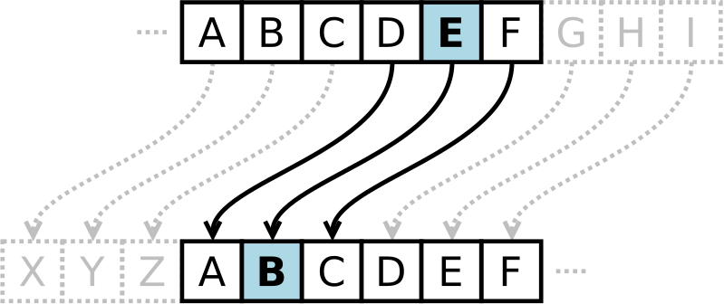
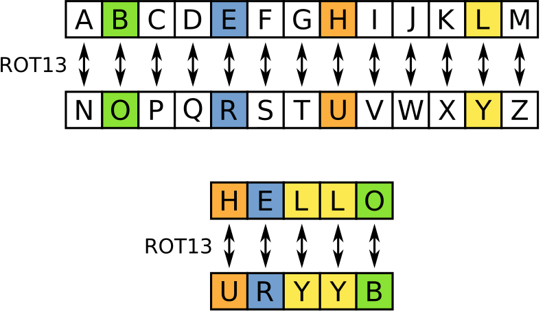

# Introduction

This project contains experiments in cryptography. The goal is to
learn about different cryptographic algorithms.

# Glossary

* Plaintext

  The plaintext is the text we want to encrypt.

* Ciphertext

  The ciphertext is the encrypted plaintext.

# Encryption Methods

## Caesar Cipher

In cryptography, a [Caesar
cipher](https://en.wikipedia.org/wiki/Caesar_cipher), also known as
Caesar's cipher, the shift cipher, Caesar's code or Caesar shift, is
one of the simplest and most widely known encryption techniques. It is
a type of substitution cipher in which each letter in the plaintext is
replaced by a letter some fixed number of positions down the alphabet.
For example, with a left shift of 3, D would be replaced by A, E would
become B, and so on. The method is named after Julius Caesar, who used
it in his private correspondence.

| Plaintext | Ciphertext |
| --------: | :--------- |
| D         | A          |
| E         | B          |
| F         | C          |

### ROT13

A special case of the Caesar cipher is known as
[ROT13](https://en.wikipedia.org/wiki/ROT13) ("rotate by 13 places",
sometimes hyphenated ROT-13). ROT13 is a simple letter substitution
cipher that replaces a letter with the 13th letter after it.

Because there are 26 letters (2×13) in the basic Latin alphabet, ROT13
is its own inverse; that is, to undo ROT13, the same algorithm is
applied, so the same action can be used for encoding and decoding

